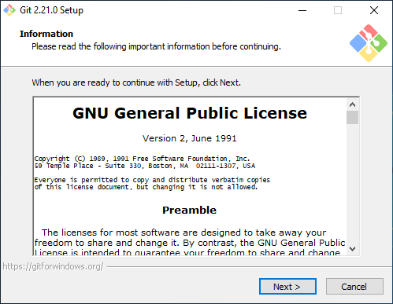
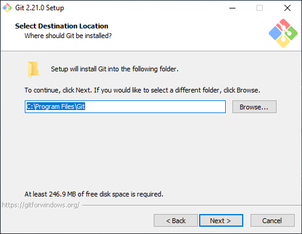
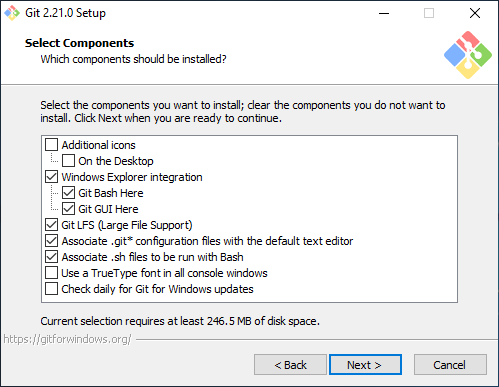
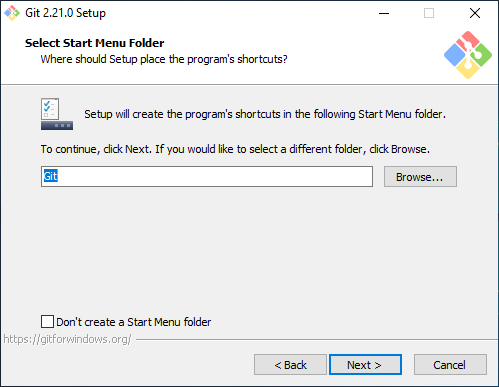
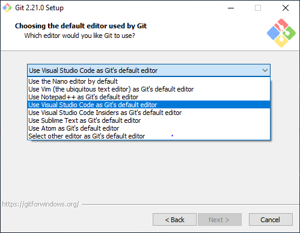
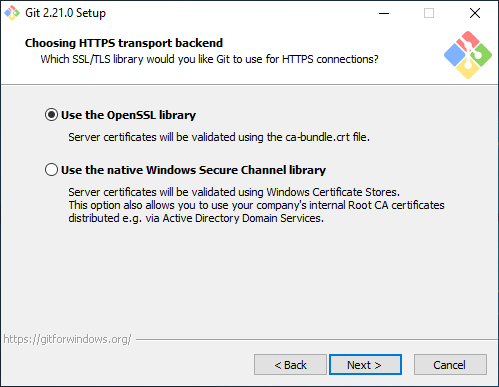
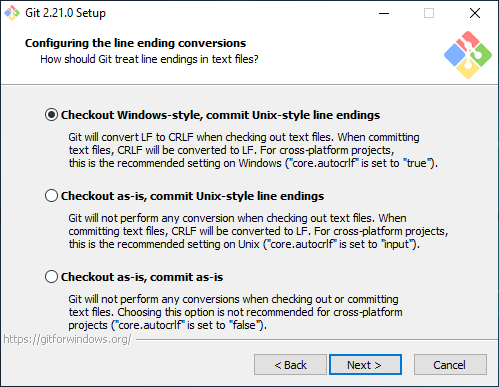
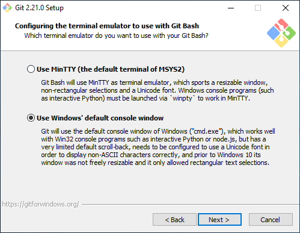
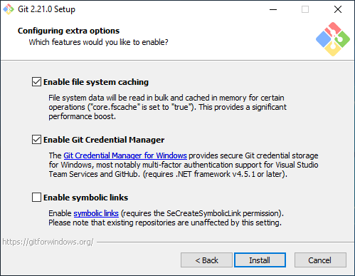
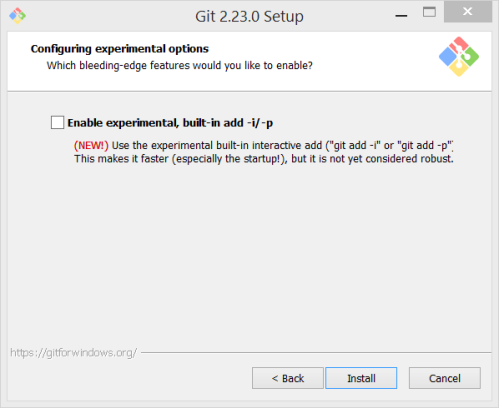

# Instalace Gitu

Návod jak si nainstalovat Git na [Windows](#windows), [Mac OS](#mac-os) a [Linux](#linux).

Pokud při instalaci narazíš na nějaké problémy nebo si nebudeš něčím jistá, napiš nám na Slacku.

## Windows

1. Stáhni si instalačku Git: <https://git-scm.com/download/win>
1. Spusť instalaci a postupuj podle následujícího návodu - buď pozorná a zkontroluj, že to máš vždy nastavené stejně jako na obrázcích!

### Instalace

1. Licence: souhlasíš, _Next_

   
1. Cíl instalace: můžeš nechat stejný, _Next_

   
1. Komponenty: nech výchozí nastavení, _Next_

   
1. Menu start: nech výchozí nastavení, _Next_

   
1. **Výchozí editor**: vyber **"Use Visual Studio Code as Git's default editor"**, _Next_

   
1. Prostředí: nech výchozí nastavení ("Git from the command line and also from 3rd-party software"), _Next_

   
1. SSL knihovna: nech výchozí nastasvení ("Use the OpenSSL library"), _Next_

   
1. Konce řádek: nech výchozí nastavení ("Checkout Windows-style, commit Unix-style line endings"), _Next_

   
1. **Terminál**: vyber **"Use Window's default console window"**, _Next_

   
1. Extra nastavení: nech zaškrtnuté vychozí nastavení a dej _Next_ (nebo _Install_, pokud tam _Next_ není - pak můžeš přeskočit ty Experimentální funkce v dalším kroku)

   
1. Experimentální funkce: experimenty jsou fajn, ale my se prozatím obejdeme bez nich. Nic nezaškrtávej a klikni na _Install_.

   
1. Počkej až doběhne instalace a ukonči instalátor
1. Spusť příkazovou řádku Windows (*Start* → *Příkazová řádka*, nebo otevří Start a napiš `cmd`)
1. Do příkazové řádky napiš příkaz `git --version` a dej enter.
    * Pokud ti příkazová řádka vynadala, že příkaz nezná, zkus ještě restartovat počítač, případně se nám ozvi na Slacku
    * Pokud se ti vypsalo něco jako `git version 2.21.0`, tak máš hotovo a můžeš se těšit na hodinu :)

## Mac OS

1. Spusť aplikaci *Terminál* a napiš do ní příkaz `git --version` a dej enter
    * Pokud se vypíše něco jako `git version 2.0.0` (číslo verze může být jiné, to nevadí), tak máš vyhráno, Git už máš nainstalovaný.
    * Pokud se tě systém zeptá, jestli chceš Git nainstalovat, dej ano a postupuj podle instrukcí na obrazovce.
    * Pokud ti to jenom vynadá, že příkaz `git` neexistuje a nic jiného se nestane, pokračuj podle tohoto návodu dál.
1. Stáhni si instalačku Gitu: <https://git-scm.com/download/mac>
1. Postupuj podle návodu pro Windows - některé obrazovky možná budou chybět nebo budou vypadat trošku jinak, v principu by ale měly být podobné nebo stejné.
1. Po instalaci spusť aplikaci Terminál a znovu v ní spusť příkaz `git --version` - tentokrát už by to mělo vypsat "git version 2.21.0".

Pokud ti něco nepůjde, neváhej se nám ozvat na Slacku, my ti poradíme :-)

## Linux

Je docela velká šance, že Git už máš nainstalovaný. Spusť terminál a napiš do něj příkaz `git --version`.
Pokud to vypíše něco jako `git version 2.0.0` (číslo verze může být jiné, to nevadí), tak už Git máš a není
co řešit. Pokud ti to nabídne instalaci, tak to ber. Pokud tě to jen pošle do háje, budeš muset Git nainstalovat sama.

Pokud nevíš, jakou máš distribuci nebo jaký tam je správce balíčku, tak prostě vyzkoušej postupně všechny následující příkazy,
dokud nějaký nebude fungovat.

* `sudo apt-get install git` (Ubuntu, Debian)
* `sudo dnf install git` (Fedora)
* `sudo yum install git` (Fedora, CentOS)
* `sudo zypper install git` (OpenSUSE, SuSE)
* `sudo pacman -S git` (ArchLinux, Manjaro)
* Jako fakt nic z toho nefungovalo? Napiš mi na Slacku, vykoumáme to ;-)

Po instalaci už by příkaz `git --version` měl fungovat.
