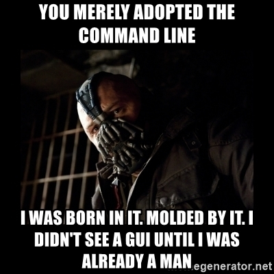
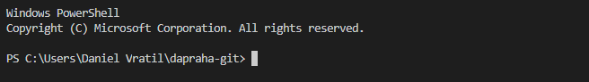
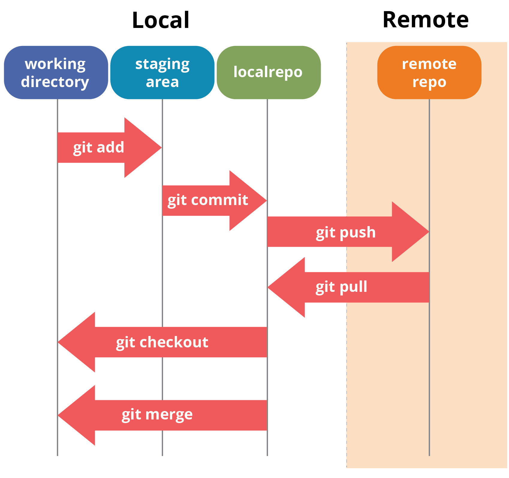

class: center, middle


---

## Co je to Git?

* VCS (_Version Control System_) - Verzovací systém

---

## Co je to verzovací systém?

* Nástroj na sledování změn v souborech a jejich sdílení
* VCS existuje spousta: CVS, SVN, BitKeeper, Bazaar, Mercurial, Git, ...
* Git je nejrozšířenější a nejpopulárnější

---

## Co je to teda ten Git, Petře!?!?

* Distribuovaný VCS _(to sem tomu pomoh', co?)_
* Uchovává historii změn souborů
* Umožňuje změny snadno sdílet s dalšími lidmi

---

## Git vs GitHub

* Git je jeden konkrétní nástroj pro verzování souborů
* GitHub je online služba, skrz kterou můžeme sdílet naše soubory a jejich historii změn 
  s ostatními
* Takových služeb existuje víc, třeba GitLab, Bitbucket, SourceForge, repo.or.cz, ...

---

# Co budeme pro Gitování potřebovat

* Příkazovou řádku
* Nainstalovaný Git
* Účet na GitHubu
* Trpělivost, odhodlání a kuráž

---

# Spooousta termínů

* Dneska nás čeká spousta nových termitů. Jako _FAKT_. _VELKÁ_. _SPOUSTA_.
* Budou se vám plést a nebudete si je pamatovat
* To nevadí, já si taky pamatuju jen ty, co používám každej den. Většinu. Některý. Pár.
* A často to prostě pokazim.. [OhShitGit](https://ohshitgit.com/cs)
* Používejte [cheat-sheet](https://education.github.com/git-cheat-sheet-education.pdf)

---
class: center, middle

# JDEME NA TO

---
class: center

# Příkazová řádka




---

# Příkazová řádka

* Znáte z Pythonu!
* Nebojte se jí, nekouše (ale může vám smazat soubory)
* Zkuste do ní napsat příkaz `git`

---

## Příkazová řádka a složky

* Na začátku řádky vidíš název aktuální složky, ve které jsi
  * Je to stejné, jako když máš otevřenou složku v Průzkumníkovi
  * Říká se tomu pracovní adresář (_working directory_)



* Příkazy v příkazové řádce se provádějí v pracovním adresáři
* Výpis obsahu pracovního adresáře: `dir` (`ls`)
* Změna pracovního adresáře: `cd složka` (`cd` = `c`hange `d`irectory)
    * Příkaz pro návrat do nadřazené složky: `cd ..`

---
class: noconsole

## Příkazy Gitu

* Samotný git má přes 120 příkazů, spoustě z nich nikdo nerozumí
* My si dnes vystačíme s cca 15 - téměř vše, co je potřeba znát

```
             říká Windows,
           že chceme spustit       ,- parametry pro konkrétní
                 Git               |  příkaz Gitu
                  |          ______|______
                 / \        /             \
      C:\slozka> git commit -m "Můj commit"
      \_______/      \____/
         |              |
 aktuální složka, ve    |
které se budou příkazy  `- říká Gitu, co má udělat
      provádět             (tzv. příkaz Gitu - git command)
```
_(a pak že programátoři nemaj umělecký nadání!)_
---

## Nápověda

* Přehled nejčastějších příkazů:
    - `git` (nebo hoď očkem do cheat-sheetu)
* Nápověda ke konkrétnímu příkazu:
    - `git help příkaz`
    * někdy hodně technické a těžko srozumitelné
* [Cheat-sheet](https://education.github.com/git-cheat-sheet-education.pdf)
---

# Konfigurace

Než začneme gitovat, musíme v gitu nastavit naše jméno a emailovou adresu

```
git config --global user.name "Petr Kubelka"
git config --global user.email petr.kubelka@avast.com
```

---

# Repozitář

* Obyčejná složka, jejíž obsah verzujeme ve VCS (v našem případě v Gitu)
* Obsah jsou všechny soubory a podsložky uvnitř repozitáře
* Můžu si ho buď vytvořit lokálně, nebo si stáhnout existující repozitář z internetu

---

## Jak si stáhnu repozitář z internetu?

V terminologii gitu se tomu říká klonování (cloning).

```
git clone https://server.com/repozitar.git
```

---
class: excer

## CVIČENÍ

* Naklonuj si můj vzorový repozitář:

```
  git clone https://github.com/KSonny4/dapraha-git.git
```

* V pracovním adresáři bys nyní měla mít složku `dapraha-git`
* Zkontroluj, že tomu tak je pomocí příkazu `dir` (pokud jsi na Macu nebo Linuxu tak `ls`)
* Otevři ji pomocí příkazu `cd dapraha-git` a podívej se, co v ní je

---

# Commity

* Vždy, když řeknete gitu, aby si zapamatoval aktuální verzi souborů, uděláte to pomocí tzv. commitu
* Commit je změna v jednom či více souborech

---

## Co obsahuje commit

* Identifikátor ("hash") commitu
* Identifikátor předchozího commitu
* Autora commitu
* Datum a čas vzniku commitu
* Popis commitu zadaný autorem
* Samotné změny

---
class: noconsole

## Jak vypadá commit
```
commit 880d9161ba9de2cb8899d3e5ceea0c8590576ad2
Author: Dan Vrátil <dan.vratil@czechitas.cz>
Date:   Wed Apr 10 17:42:29 2019 +0200

    Oprava nevinného překlepu

diff --git a/prezentace.md b/prezentace.md
index 46aa983..f0ee52c 100644
--- a/prezentace.md
+++ b/prezentace.md
@@ -132,5 +132,5 @@
 * identifikátor předchozího commitu
 * autora commitu
-* datum a čas vzňyku commitu
+* datum a čas vzniku commitu
 * popis commitu zadaný autorem
 * samotné změny
```
---

## Zobrazení commitu

```
git show 880d9161ba9de2cb8899d3e5ceea0c8590576ad2
```
```
git show 880d91
```

---
class: excer

## CVIČENÍ

* Zobraz si commit `6a0d` (`6a0d097a73b446110ebce85bf51e3547f6ab0ffd`)

---

# Historie

* Historie je série commitů
* V jednom repozitáři může být i více historií, které se mohou různě větvit
* Historii říkáme `branch`, česky _větev_, slovensky _vetva_, latinsky _genere_
* Hlavní větev se jmenuje `master` a existuje (skoro) v každém repozitáři
* K větvím se podrobněji vrátíme později (možná)

---

## Zobrazení historie

```
git log
```

---
class: excer

## CVIČENÍ

* Pokochej se historií mého repozitáře

---
class: center, middle

# Tvoříme historii

---

## Stav repozitáře

```
git status
```

Řekne nám, na jaké jsme aktuálně větvi, které soubory v repozitáři jsou změněné,
které jsou připravené na commit, případně které soubory git zatím ještě neverzuje.

---

## Aktuální změny

```
git diff
```

Zobrazí rozdíl mezi posledním commitem a aktuálním stavem všech souborů.

---
class: excer

## CVIČENÍ

* Zobraz si stav repozitáře
* Uprav v repozitáři nějaký existující soubor
* Znovu si zobraz stav repozitáře
* Zobraz si aktuální změny

---

# Tvoříme commit

```
git commit -a -m "Můj první commitek"
```

* `-a` říká gitu, že chceme commitnout všechny změny v repozitáři
* `-m "Commit message"` nastaví popis commitu

---
class: excer

## CVIČENÍ

* Změň si nějaký soubor v repozitáři a udělej commit
* Podívej se, jaký je stav repozitáře před a po commitu
* Podívej se na svůj commit v historii a zobraz si ho

---

## Staging

* `git commit -a` vloží do commitu všechny aktuální změny v repozitáři
* Někdy ale chceme commitnout jenom změny v některých souborech (nebo dokonce
  jenom některé změny v souboru)
* Změny, které chceme commitnout, musíme přidat do tzv. _stage_


```
git add zmeneny-soubor.txt
git commit -m "Popis změny"
```

---
class: center, middle
## Staging



---

## Stagnuté změny

```
git diff --staged
```

* Zobrazí rozdíl mezi posledním commitem a aktuálně stagnutými změnami
* Hodí se na kontrolu toho, co vlastně bude v commitu před tím, než spustíš `git commit`

---
class: excer

## CVIČENÍ

* Změň si nějaké dva soubory v repozitáři
* Podívej se na stav repozitáře
* Přidej jeden ze změněných souborů do stage, druhý nech být
* Znovu si nech zobrazit stav repozitáře
* Zobraz si stagnuté změny
* Udělej nový commit
* Zobraz si znovu stav repozitáře

---
class: center, middle
# Synchronizace mezi repozitáři

---

## Stahování změn

Jak si stáhnu nové změny třeba z GitHubu?


```
git pull
```

Pokuď jste udělali v předchozím cvičení chybu, může vám vzniknout merge conflict (o těch později).

---
class: excer

### CVIČENÍ

* Prohlédni si svou historii gitu
* Stáhni si změny, které jsem nahrál na GitHub
* Znovu se podívej na svou historii - vidíš v ní mou novou změnu?

---

## Odbočka: Forkování repozitářů

* Do svého repozitáře můžu nahrávat změny pouze já
* Pokud do mého repozitáře chcete nahrávat taky, musím vám dát přístup _(nedám!)_
--

* Otevři si můj repozitář na Githubu: https://github.com/KSonny4/dapraha-git
* Vpravo nahoře klikni na tlačítko "Fork"
* GitHub udělá pod tvým účtem kopii mého repozitáře, do které můžeš zapisovat

---
class: excer

### CVIČENÍ

* Vylez ze svého repozitáře (`cd ..`)
* Naklonuj si z GitHubu svůj fork:

```
git clone https://github.com/TvojePřezdívka/dapraha-git moje-dapraha-git
```

* Vlez do složky se svým klonem: `cd moje-dapraha-git`

---

## Nahrávání změn

```
git push
```

--

Někdy je potřeba specifikovat kam (tzv. "remote") a do jaké větve se mají změny nahrát:

```
git push origin master
```

---
class: excer

### CVIČENÍ

* udělej ve svém repozitáři nějaké změny a commitni je
* nahraj je na GitHub pomocí `git push`
* podívej se na svůj učet přímo na GitHubu, jestli tam změny uvidíš

---

# Rekapitulace

* Repozitář je složka, jejíž obsah je verzovaný gitem
* Repozitář obsahuje historii změn, tzv. commitů


```
git clone adresa
```

---

```
git status
```
--
```
git diff
```
--
```
git add zmeneny-soubor.txt
```
--
```
git diff --staged
```
--
```
git commit -m "Popis commitu"
```
--
```
git push
```

---
class: excer

# Velké cvičení

* Založ si repozitář na GitHubu (ukážu jak)
* Naklonuj si ho do počítače
* Vytvoř v něm soubor `program.py`, který vypíše náhodné číslo od 1 do 100 _(snad sis nemyslela, že Ti to dneska projde bez Pythonu ;-)_
* Svůj program commitni do gitu a pushni na GitHub
* Potom ještě program uprav tak, aby vypisoval náhodná čísla v rozsahu, který uživatel zadá jako parametr příkazové řádky _(Martin a Dan na tebe bude hrdej!)_
* Nové změny commitni a pushni na GitHub
* Podívej se, že tam opravdu jsou _(teď na tebe zas můžu bejt hrdej já)_

---

# Stash

Někdy potřebujeme necommitnuté změny na chvilku "schovat", třeba abychom mohli udělat `git pull`,
a pak je zase vytáhnout. Na to nám Git nabízí tzv. `stash`.

Pro uložení všech necommitnutých změn do stashe slouží následující příkaz:

```
git stash
```

Pro opětovné vytažení změn ze stashe slouží parametr `pop`:

```
git stash pop
```

---
class: excer

## CVIČENÍ

* Udělej si lokálně pár změn, ale necommituj je
* Pomocí `git status` a `git diff` se na změny podívej
* Nyní tyhle změny schovej do stashe
* Znovu se podívej na stav repozitáře - neměla bys vidět žádné změny
* Nyní zase změny ze stashe vytáhni
* A znovu se podívej na stav repozitáře - vše by mělo být jako před tím, než si změny zastashovala

---

# Merge konflikty

* Nikdo je nemá rád
* Objevují se, když to nejméně čekáš (a potřebuješ)
* Dřív nebo později se s nimi setká každý gitovník

---

## Co je to merge konflikt?

Když můj lokální klon repozitáře i server mají novou změnu, která mění stejnou řádku, nastává konflikt

Situace: já i Petr jsme každý ve svém klonu repozitáře změnili stejnou řádku ve stejném souboru (každý trochu jinak) a udělali commit.

Problém: když Petr pushne svou změnu na GitHub a já si ji zkusím stáhnout, nastane konflikt, protože Git neví, jak má Petrovu změnu napasovat na mojí.

---
class: noconsole

## Jak se řeší merge konflikt?

Blbě.

--

Git mi do souboru, ve kterém nastal merge konflikt, uloží obě varianty a je na mně, abych si vybral:

```
<<<<<<< HEAD
Tohle je řádka, kterou jsem změnil já, Dan.
=======
Tohle je řádka, kterou jsme změnil já, Petr.
>>>>>>> master
```

--

Jak konflikt vyřeším je na mně. Mohu zahodit svou změnu, Petrovu změnu, nebo můžu celou řádku přepsat
tak, aby nějakým způsobem zůstaly zachovány obě změny, třeba takto:

```
Tohle je řádka, kterou jsme změnili my, Dan a Petr.
```

---
class: excer

## Merge konflikt v praxi

* Přesuň se do klonu mého původního repozitáře
* V souboru `priklady/merge-conflict.txt` změň první řádek a udělej commit
--

* Já jsem udělal to samé a commit jsem pushnul na GitHub
* Když zkusíš udělat `git pull`, nastane merge konflikt
--

* Merge konflikt vyřeš a příkazem `git commit` své řešení commitni
